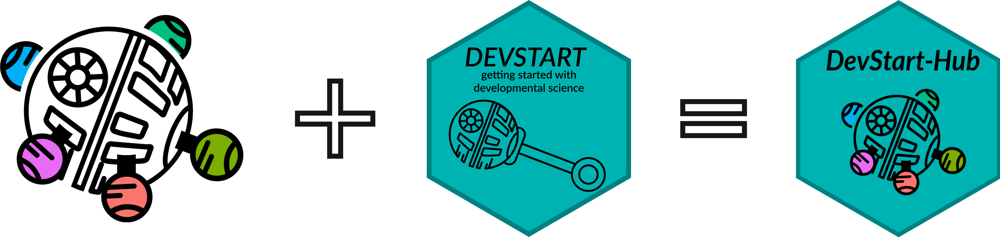

# DEVSTART Hub 

Welcome to the **DEVSTART Hub** 👋  

This repository contains the **rendered output** of the [DEVSTART](https://github.com/DevStart-Hub/DevStart) website.  
The source materials (tutorials, documentation, and guides) are written and maintained in the main DEVSTART repository, while this one takes care of hosting the finished site.

Updates happen automatically through a GitHub Action: whenever the main DEVSTART repo changes, the site is published here. This ensures the website is always up to date.  

- 👉 [DEVSTART source repository](https://github.com/DevStart-Hub/DevStart) — where the content is written  
- 🌐 [Live website](https://devstart.org) — where everything comes together
